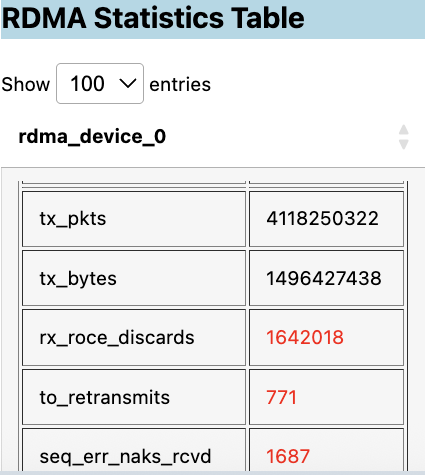
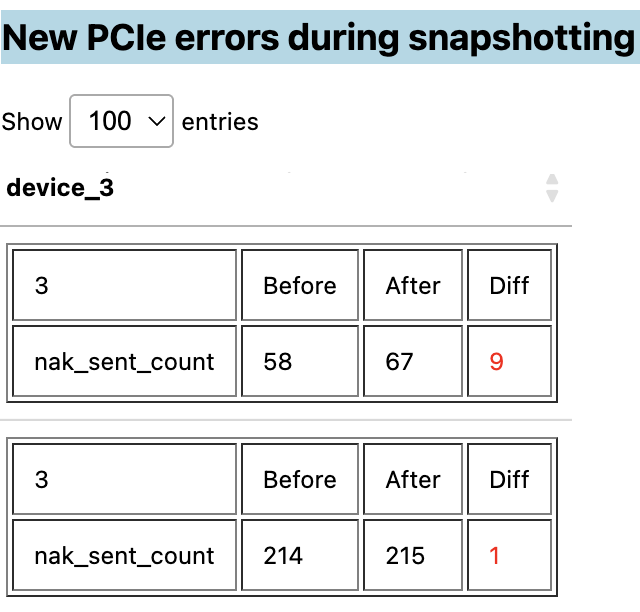

.. meta::
  :description: Run the Cluster Health Check monitor to generate a health report of your GPU cluster
  :keywords: CVS, health, network, tests, RCCL 

**********************************
Monitor the health of GPU clusters
**********************************

Monitor the health of your cluster with the Cluster Health Check monitor, a utility that generates an overall health report by collecting logs and metrics of the GPU nodes cluster-wide.

The monitor doesn't require any agent/plugin/exporters to be installed or any controller virtual machines.

The monitor identifies any hardware failure/degradation signatures like RAS errors, PCIe/XGMI errors, or network drop / error counters using `AMD SMI <https://rocm.docs.amd.com/projects/amdsmi/en/latest/install/install.html>`_. 
It can also identify software failures by searching for failing signatures in the ``dmesg`` and ``journlctl`` logs.

The monitor also acts as a triaging tool to troubleshoot any performance issues that may be related to the AI infrastructure. 
You can use it to take a snapshot of all counters (GPU/NIC) while your training/inference workloads are in progress, 
then compare the counters and identify any increment of unexpected counters across all nodes in the cluster to find issues.

Generate a health report
========================

Run the Cluster Health Check monitor to generate a health report for your clusters using the CVS CLI. 

To run the monitor and generate a health report for a cluster:

1. Ensure you've completed the :doc:`Cluster Validation Suite installation </install/cvs-install>`.
2. Open a new Terminal.
3. List available monitors:

   .. code:: bash

    cvs monitor

4. View help for the check_cluster_health monitor:

   .. code:: bash

    cvs monitor check_cluster_health --help

5. Run the monitor with the applicable arguments for your use case:

   - ``--hosts``: Direct the monitor to the file with the list of host IP addresses you want to check.
   - ``--username``: Enter the username to SSH to the hosts.
   - ``--password``: Enter the password to SSH to the hosts
   - ``--key_file``: Enter the private Keyfile for the username.
   - ``--iterations``: Enter the number of check iterations you want to run.
   - ``--time_between_iters``: Enter the time to wait between run iterations.
   - ``--report_file``: Enter the directory you want the generated health file to save to. If you leave this argument empty, the file saves as ``cluster_report.html`` to the local directory.  

   Here's an example command with some arguments set:

   .. code:: bash

    cvs monitor check_cluster_health --hosts /home/user/input/host_file.txt --username myusername --key_file /home/user/input/.ssh/id_test --iterations 2

   The monitor logs into the nodes based on the hosts specified and captures information on potential error conditions or anomalies. 

6. Open the ``cluster_report.html`` file to view the generated health report for the cluster.

Review the health report
========================

Open the generated health report to view snapshotted information on your cluster such as the:

- GPU information
- NIC information
- Historic error logs
- Snapshot differences for triaging

It looks for any potential errors, then graphs them in tables separated by categories such as PCIe errors, RDMA statistics, network congestion errors, GPU errors, or GPU cable issues. 
Detected anomalies are highlighted in red:

The delta between snapshotted values are also highlighted in red, depending on the category:

The report also displays potential kernel errors in the ``dmesg`` and ``journlctl`` logs:

.. image:: ../images/journlctl.png

Use the logs in the health report to diagnose and triage node errors in your GPU clusters.

These values in these reports are captured using these ROCm AMD SMI commands:

.. code:: bash

  sudo rocm-smi -a --json
  sudo amd-smi partition --json
  sudo amd-smi process --json
  sudo amd-smi metric --json
  sudo amd-smi firmware --json
  sudo amd-smi metric --ecc --json
  sudo amd-smi metric --pcie --json
  sudo rocm-smi --loglevel error --showmemuse --json
  sudo rocm-smi --loglevel error --showuse --json
  sudo rocm-smi --loglevel error --showmetric --json
  sudo rocm-smi --loglevel error --showfwinfo --json
  sudo rocm-smi --loglevel error --showbus --json
  sudo rocm-smi --loglevel error --showproductname --json
  sudo rocm-smi --loglevel error --showtemp —json
  sudo ethtool -S <iface>
  sudo rdma link
  sudo rdma statististic

.. tip::

  See the `AMD SMI Commands reference <https://rocm.docs.amd.com/projects/amdsmi/en/latest/how-to/amdsmi-cli-tool.html#commands>`_ for more information on how the Cluster Health Check monitor captures these metrics and their definitions.

