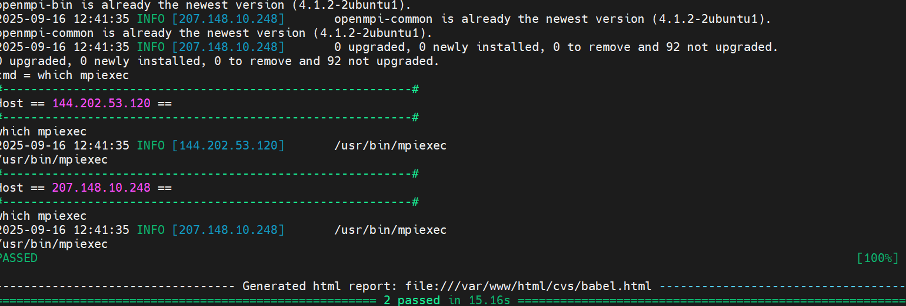
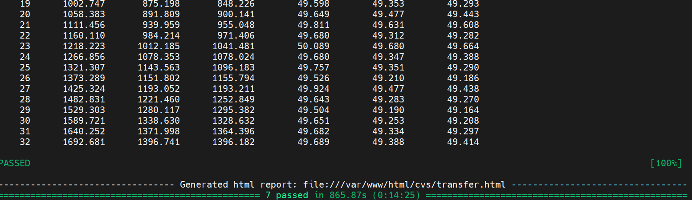
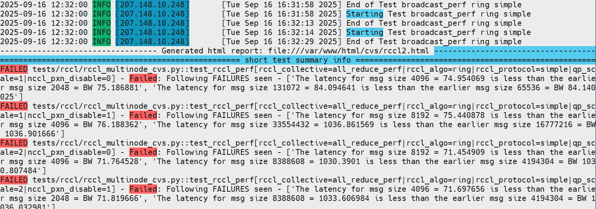
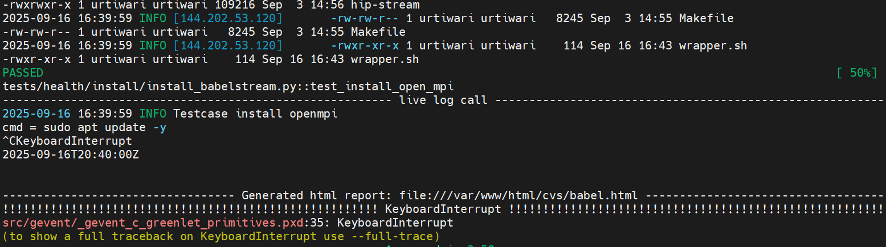

.. meta::
  :description: Run CVS test scripts
  :keywords: CVS, health, network, tests, RCCL 

***********************************
Run Cluster Validation Suites tests
***********************************

The CVS PyTest scripts are in the ``cvs/tests`` folder of the cloned GitHub repository. 
Every test must be run from the cvs root folder, as the system lib paths have been set accordingly.

These are the arguments typically used in these test scripts:

- ``-log-file``: The text log file where the Python logger outputs are captured.
- ``-s``: The script that PyTest executes.
- ``--cluster_file``: The location of the cluster file, which has the details of the cluster, IPs, and access details.
- ``--config_file``: This is the configuration file used for the test. Depending on the test suite being run, the configuration might vary. The sample input files are organized as sub-directories under the ``cvs/input`` folder, similar to the PyTests.
- ``--html``: This is the output HTML report file generated by PyTest at the end of the script. It has a summary of the number of test cases that have passed/failed. You can navigate to the logs directly in the browser from this report.
- ``--capture=tee-sys``: Captures all ``std.out`` and ``std.err`` writes from your tests.
- ``--self-contained-html``: Generate as a single HTML report, including the styling and embedded images for all test cases.

You can also create a wrapper shell script to run multiple test suites sequentially by putting the different PyTest run commands in a bash script as described in the README file under the ``cvs/tests/health`` folder.

Run CVS test scripts
====================

Platform test script
--------------------

The host check scripts can validate various host-side configurations, such as model load balancing enablement, PCIe checks, kernel version, and ROCm version.

Here are the host check test cases:

- ``check_os_release``
- ``check_kernel_version``
- ``check_bios_version``
- ``check_gpu_fw_version``
- ``check_online_memory``
- ``check_dmesg_driver_errors``
- ``check_rocm_version``
- ``check_pci_realloc``
- ``check_iommu_pt``
- ``check_numa_balancing``
- ``check_pci_accelarators``  
- ``check_pci_speed_width``
- ``check_pci_acs``

Here's the test script:

.. code:: bash

  pytest -vvv --log-file=/tmp/test.log -s ./tests/platform/host_configs_cvs.py --cluster_file input/cluster_file/cluster.json  --config_file input/config_file/platform/host_config.json --html=/var/www/html/cvs/host.html --capture=tee-sys --self-contained-html

Burn-in health test scripts
---------------------------

The burn-in health tests are single node diagnostic tests that validate the hardware and firmware versions' functionality and performance. 
For the performance validation, they use the reference bandwidth or latency numbers provided as part of the input ``config_file`` for the relevant test. 

Use these scripts to run each health test. These CVS test scripts have two parts: installing the functionality and running the tests.

AGFHC
~~~~~

See the `AGFHC (AMD GPU Field Health Check) <https://instinct.docs.amd.com/projects/gpu-operator/en/latest/test/agfhc.html>`_ docs for more information.

These are the test cases for AGFHC:

- ``test_agfhc_hbm``
- ``test_agfhc_hbm1_lvl5``
- ``test_agfhc_hbm2_lvl5``
- ``test_agfhc_hbm3_lvl3``
- ``test_agfhc_dma_all_lvl1``
- ``test_agfhc_dma_lvl1``
- ``test_agfhc_gfx_lvl1``
- ``test_agfhc_pcie_lvl1``
- ``test_agfhc_pcie_lvl3``
- ``test_agfhc_xgmi_lvl1``
- ``test_agfhc_all_perf``
- ``test_agfhc_all_lvl5``

Use these scripts to start the test:

1. Run the installation: 

   .. code:: bash 

     pytest -vvv --log-file=/tmp/test.log -s ./tests/health/install/install_agfhc.py --cluster_file input/cluster_file/cluster.json --config_file input/config_file/health/mi300_health_config.json --html=/var/www/html/cvs/agfhc.html --capture=tee-sys --self-contained-html

2. Run the AGFHC test:

   .. code:: bash
    
     pytest -vvv --log-file=/tmp/test.log -s ./tests/health/agfhc_cvs.py --cluster_file input/cluster_file/cluster.json --config_file input/config_file/health/mi300_health_config.json --html=/var/www/html/cvs/agfhc.html --capture=tee-sys --self-contained-html

3. Run the CSP qualification test:

   .. code:: bash
    
     pytest -vvv --log-file=/tmp/test.log -s ./tests/health/csp_qual_agfhc.py --cluster_file input/cluster_file/cluster.json --config_file input/config_file/health/mi300_health_config.json --html=/var/www/html/cvs/agfhc.html --capture=tee-sys --self-contained-html

TransferBench
~~~~~~~~~~~~~

See the `TransferBench <https://rocm.docs.amd.com/projects/TransferBench/en/latest/install/install.html#install-transferbench>`_ docs for more information.

These are the test cases for TransferBench:

- ``test_transfer_bench_example_tests_1_6_t``
- ``test_transfer_bench_a2a``
- ``test_transfer_bench_p2p``
- ``test_transfer_bench_healthcheck``
- ``test_transfer_bench_a2asweep``
- ``test_transfer_bench_scaling``
- ``test_transfer_bench_schmoo``

Use these scripts to start the test:

1. Run the installation: 

   .. code:: bash

     pytest -vvv --log-file=/tmp/test.log -s ./tests/health/install/install_transferbench.py --cluster_file input/cluster_file/cluster.json  --config_file input/config_file/health/mi300_health_config.json --html=/var/www/html/cvs/transferbench.html --capture=tee-sys --self-contained-html

2. Start the TransferBench test:

   .. code:: bash
    
     pytest -vvv --log-file=/tmp/test.log -s ./tests/health/transferbench_cvs.py --cluster_file input/cluster_file/cluster.json  --config_file input/config_file/health/mi300_health_config.json --html=/var/www/html/cvs/transferbench.html --capture=tee-sys --self-contained-html

RVS
~~~

See the `ROCm Validation Suite (RVS) <https://rocm.docs.amd.com/projects/ROCmValidationSuite/en/latest/install/installation.html>`_ docs for more information.

These are the test cases for RVS:

- ``gpup_single``
- ``mem_test``
- ``gst_single``
- ``iet_single``
- ``pebb_single``
- ``pbqt_single``
- ``peqt_single``
- ``rcqt_single``
- ``tst_single``
- ``babel_stream``

Use these scripts to start the test:

1. Run the installation: 

   .. code:: bash

     pytest -vvv --log-file=/tmp/test.log -s ./tests/health/install/install_rvs.py --cluster_file input/cluster_file/cluster.json  --config_file input/config_file/health/mi300_health_config.json --html=/var/www/html/cvs/rvs.html --capture=tee-sys --self-contained-html

2. Start the RVS test: 

   .. code:: bash
    
     pytest -vvv --log-file=/tmp/test.log -s ./tests/health/rvs_cvs.py --cluster_file input/cluster_file/cluster.json  --config_file input/config_file/health/mi300_health_config.json --html=/var/www/html/cvs/rvs.html --capture=tee-sys --self-contained-html

InfiniBand (IB Perf) test script
--------------------------------

IB Perf and latency tests measure network performance. Perf tests measure throughput (bandwidth), and latency tests measure delay. 
Perf tests, such as ``ib_write_bw``, evaluate the maximum data transfer rate under different message sizes. 
Latency tests, such as ``ib_send_lat``, measure the time it takes for a message to travel between two nodes and often report results like minimum, median, and maximum latency.

These are the IB Perf test cases:

- ``test_install_ib_perf``
- ``test_ib_bw_perf``
- ``test_ib_lat_perf``
- ``test_build_ib_bw_perf_chart``
- ``test_build_ib_lat_perf_chart``

Use these scripts to start the test:

1. Run the installation: 

   .. code:: bash

     pytest -vvv --log-file=/tmp/test.log -s ./tests/ibperf/install_ibperf_tools.py --cluster_file input/cluster_file/cluster.json --config_file input/config_file/ibperf/ibperf_config.json --html=/var/www/html/cvs/ib.html --capture=tee-sys --self-contained-html

2. Start the IB Perf test:

   .. code:: bash

     pytest -vvv --log-file=/tmp/test.log -s ./tests/ibperf/ib_perf_bw_test.py --cluster_file input/cluster_file/cluster.json --config_file input/config_file/ibperf/ibperf_config.json --html=/var/www/html/cvs/ib.html --capture=tee-sys --self-contained-html

ROCm Communication Collectives Library (RCCL) test script
---------------------------------------------------------

These RCCL tests are comprehensive benchmarks that validate distributed GPU communication performance across AMD GPU clusters. 
These tests ensure optimal performance for AI training, HPC workloads, and distributed computing.

Here are the RCCL test cases:

- ``hostinfo``
- ``networkinfo``
- ``all_reduce_perf``
- ``all_gather_perf``
- ``scatter_perf``
- ``gather_perf``
- ``reduce_scatter_perf0``
- ``reduce_scatter_perf1``
- ``sendrecv_perf``
- ``alltoall_perf``
- ``alltoallv_perf``
- ``broadcast_perf``

.. note::

  You should already have your RCCL environment setup in all of the nodes. If not, see `Build collective tests <https://instinct.docs.amd.com/projects/gpu-cluster-networking/en/latest/how-to/multi-node-config.html#build-collective-tests>`_ for more information. 

Use these test scripts to run the JAX tests.

Single node test MI35XX
~~~~~~~~~~~~~~~~~~~~~~~

.. code:: bash

  pytest -vvv --log-file=/tmp/test.log -s ./tests/rccl/rccl_singlenode_cvs.py --cluster_file input/cluster_file/cluster.json --config_file input/config_file/rccl/single_node_mi355_rccl.json --html=/var/www/html/cvs/rccl.html --capture=tee-sys --self-contained-html

Multi-node test MI3XX
~~~~~~~~~~~~~~~~~~~~~

.. code:: bash

  pytest -vvv --log-file=/tmp/test.log -s ./tests/rccl/rccl_multinode_cvs.py --cluster_file input/cluster_file/cluster.json --config_file input/config_file/rccl/rccl_config.json --html=/var/www/html/cvs/rccl.html --capture=tee-sys --self-contained-html

JAX training test scripts
-------------------------

The JAX training tests perform end-to-end orchestration and validation of a distributed JAX training run (Llama 3.1) across a multi-node cluster using Docker containers, 
remote execution, and the project's JAX library. 

The file uses PyTest and parallel SSH to prepare the environment, launch containers, and run/verify a short distributed training job.

These are the JAX training test cases:

- ``test_llama_3_1_70b_training``
- ``test_llama_3_1_405b_distributed``
- ``test_llama_3_1_70b_training``
- ``test_llama_3_1_405b_distributed``

Use these test scripts to run the JAX tests.

.. note::

  Ensure all nodes are capable of running dockers.

Single Node 70b MI3XX
~~~~~~~~~~~~~~~~~~~~~

.. code:: bash

  pytest -vvv --log-file=/tmp/test.log -s ./tests/training/jax/singlenode_llama_3_1_70b.py --cluster_file input/cluster_file/cluster.json  --config_file input/config_file/training/jax/mi300x_singlenode_llama3_1_70b.json --html=/var/www/html/cvs/jax.html --capture=tee-sys --self-contained-html
 
Single Node 70b MI35X
~~~~~~~~~~~~~~~~~~~~~

.. code:: bash

  pytest -vvv --log-file=/tmp/test.log -s ./tests/training/jax/singlenode_llama_3_1_70b.py --cluster_file input/cluster_file/cluster.json  --config_file input/config_file/training/jax/mi35x_singlenode_llama_3_1_70b.json --html=/var/www/html/cvs/jax.html --capture=tee-sys --self-contained-html
 
Distributed 70b MI3XX
~~~~~~~~~~~~~~~~~~~~~

.. code:: bash

  pytest -vvv --log-file=/tmp/test.log -s ./tests/training/jax/distributed_llama_3_1_70b.py --cluster_file input/cluster_file/cluster.json  --config_file input/config_file/training/jax/mi300x_distributed_llama3_1_70b.json --html=/var/www/html/cvs/jax.html --capture=tee-sys --self-contained-html
 
Distributed 405b MI3XX
~~~~~~~~~~~~~~~~~~~~~

.. code:: bash

  pytest -vvv --log-file=/tmp/test.log -s ./tests/training/jax/distributed_llama3_1_405b.py --cluster_file input/cluster_file/cluster.json  --config_file input/config_file/training/jax/mi300x_distributed_llama_3_1_405b.json --html=/var/www/html/cvs/jax.html --capture=tee-sys --self-contained-html

Megatron training test scripts
------------------------------

Megatron training enables scaling transformer models from millions to trillions of parameters by efficiently utilizing hundreds or thousands of GPUs across multiple nodes.

The Megatron tests check:

- **Container orchestration**: Docker setup with ROCm/RDMA
- **Multi-node communication**: NCCL/RCCL initialization
- **Model convergence**: Loss decreases and no NaN/Inf values
- **Performance targets**: Throughput and memory usage within expected ranges
- **Result verification**: Expected tokens/sec and TFLOPS metrics

Here are the Megatron training test cases:

- ``test_disable_firewall``
- ``test_cleanup_stale_containers``
- ``test_launch_megatron_containers``
- ``test_llama_3_1_fp8_single_node``
 
Use these scripts to run the Megatron tests.

Single Node 8b MI3XX
~~~~~~~~~~~~~~~~~~~~

.. code:: bash

  pytest -vvv --log-file=/tmp/test.log -s ./tests/training/megatron/singlenode_llama_3_1_8b.py --cluster_file input/cluster_file/cluster.json  --config_file input/config_file/training/megatron/mi3xx_singlenode_megatron_llama.json --html=/var/www/html/cvs/megatron.html --capture=tee-sys --self-contained-html

Single Node 8b MI35X
~~~~~~~~~~~~~~~~~~~~

.. code:: bash

  pytest -vvv --log-file=/tmp/test.log -s ./tests/training/megatron/singlenode_llama_3_1_8b.py --cluster_file input/cluster_file/cluster.json  --config_file input/config_file/training/megatron/ mi35x_singlenode_megatron_llama.json --html=/var/www/html/cvs/megatron.html --capture=tee-sys --self-contained-html

Single Node 70b MI3XX
~~~~~~~~~~~~~~~~~~~~~

.. code:: bash

  pytest -vvv --log-file=/tmp/test.log -s ./tests/training/megatron/singlenode_llama_3_1_70b.py --cluster_file input/cluster_file/cluster.json  --config_file input/config_file/training/megatron/mi3xx_singlenode_megatron_llama.json --html=/var/www/html/cvs/megatron.html --capture=tee-sys --self-contained-html

Single Node 70b MI35X
~~~~~~~~~~~~~~~~~~~~~

.. code:: bash

  pytest -vvv --log-file=/tmp/test.log -s ./tests/training/megatron/singlenode_llama_3_1_70b.py --cluster_file input/cluster_file/cluster.json  --config_file input/config_file/training/megatron/mi35x_singlenode_megatron_llama.json --html=/var/www/html/cvs/megatron.html --capture=tee-sys --self-contained-html

Distributed 8b
~~~~~~~~~~~~~~

.. code:: bash

  pytest -vvv --log-file=/tmp/test.log -s ./tests/training/megatron/distributed_llama3_1_8b.py --cluster_file input/cluster_file/cluster.json  --config_file input/config_file/training/megatron/ mi3xx_distributed_megatron_llama.json --html=/var/www/html/cvs/megatron.html --capture=tee-sys --self-contained-html

Distributed 70b
~~~~~~~~~~~~~~~

.. code:: bash

  pytest -vvv --log-file=/tmp/test.log -s ./tests/training/megatron/distributed_llama3_1_70b.py --cluster_file input/cluster_file/cluster.json  --config_file input/config_file/training/megatron/ mi3xx_distributed_megatron_llama.json --html=/var/www/html/cvs/megatron.html --capture=tee-sys --self-contained-html

Test results
============

The test output is captured in an HTML report generated by PyTest. 
It provides a summary of the number of test cases that have passed/failed. You can navigate to the logs directly in the browser from this report.

CVS creates a log folder and captures the output of every test in a log file here: ``$HOME/tmp/test.log``

.. tip::

  If there are any errors that prevent the tests from starting, an error message with an appropriate suggestion will be printed in the console.

Test output examples
--------------------

Test results are also displayed on the console.

Here's an example of the output when a test installs the functionality successfully:

Here's an example of the output when the test runs successfully:

If the test fails, a message displays in the summary info:

You can also cancel tests by pressing **Ctrl-C**:

