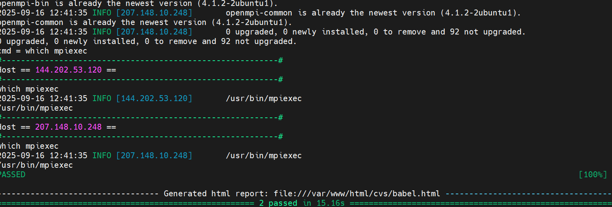
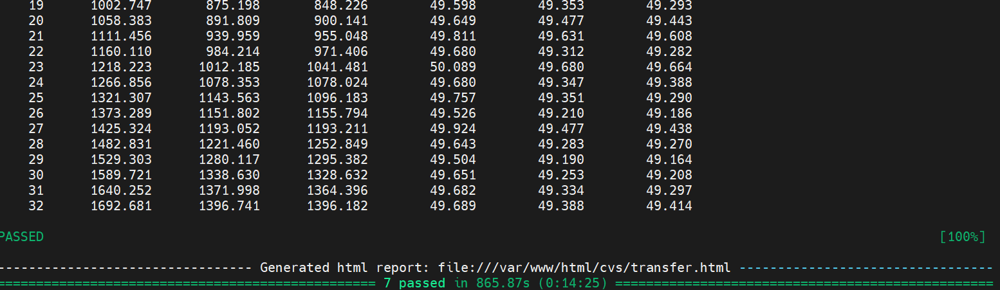
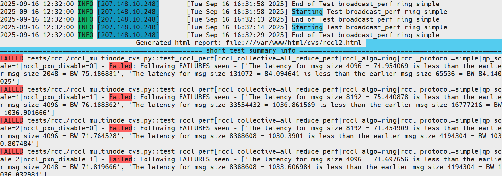
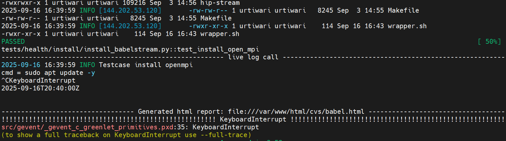

.. meta::
  :description: Run CVS test scripts
  :keywords: CVS, health, network, tests, RCCL 

***********************************
Run Cluster Validation Suites tests
***********************************

You can list available tests using either `cvs run` (with no arguments) or `cvs list`:

.. code:: bash

  cvs run
  cvs list

.. code:: text

  Available Tests
  ================================================================================
  
  Package: cvs
  --------------------------------------------------------------------------------
  
    cvs.tests.benchmark (1 test suite)
      • test_aorta
  
    cvs.tests.health (4 test suites)
      • agfhc_cvs
      • csp_qual_agfhc
      • rvs_cvs
      • transferbench_cvs
  
    cvs.tests.health.install (5 test suites)
      • install_agfhc
      • install_babelstream
      • install_rocblas
      • install_rvs
      • install_transferbench
  
    cvs.tests.ibperf (2 test suites)
      • ib_perf_bw_test
      • install_ibperf_tools
  
    cvs.tests.inference.inferencemax (1 test suite)
      • inferencemax_gpt_oss_120b_single
  
    cvs.tests.inference.pytorch_xdit (2 test suites)
      • pytorch_xdit_flux1_dev_single
      • pytorch_xdit_wan22_14b_single
  
    cvs.tests.inference.sglang (2 test suites)
      • sglang_deepseek_r1_671b_distributed
      • sglang_llama_70b_distributed
  
    cvs.tests.inference.vllm (4 test suites)
      • vllm_deepseek31_685b_single
      • vllm_gpt_oss_120b_single
      • vllm_qwen3_235b_single
      • vllm_qwen3_80b_single
  
    cvs.tests.mori (1 test suite)
      • mori_benchmark_test
  
    cvs.tests.platform (1 test suite)
      • host_configs_cvs
  
    cvs.tests.rccl (4 test suites)
      • rccl_heatmap_cvs
      • rccl_multinode_cvs
      • rccl_multinode_default_cvs
      • rccl_singlenode_cvs
  
    cvs.tests.training.jax (3 test suites)
      • jax_llama3_1_405b_distributed
      • jax_llama3_1_70b_distributed
      • jax_llama3_1_70b_single
  
    cvs.tests.training.megatron (4 test suites)
      • megatron_llama3_1_70b_distributed
      • megatron_llama3_1_70b_single
      • megatron_llama3_1_8b_distributed
      • megatron_llama3_1_8b_single
  
  ================================================================================
  Total: 34 test suites across 1 package(s)

Run all tests in a file:

.. code:: bash

   cvs run agfhc_cvs --cluster_file input/cluster_file/cluster.json --config_file input/config_file/health/mi300_health_config.json --html=/var/www/html/cvs/agfhc.html --capture=tee-sys --self-contained-html --log-file=/tmp/test.log -vvv -s

Run a specific test function:

.. code:: bash

   cvs run agfhc_cvs test_agfhc_hbm --cluster_file input/cluster_file/cluster.json --config_file input/config_file/health/mi300_health_config.json --html=/var/www/html/cvs/agfhc.html --capture=tee-sys --self-contained-html --log-file=/tmp/test.log -vvv -s

Collect tests only (dry run):

.. code:: bash

   cvs run agfhc_cvs --collect-only

All pytest options (such as `--html`, `--self-contained-html`, `--log-file`, `--capture`, `-vvv`, `-s`, etc.) can be passed to `cvs run`.

These are the arguments typically used in these test scripts:

- ``--log-file``: The text log file where the Python logger outputs are captured.
- ``--cluster_file``: The location of the cluster file, which has the details of the cluster, IPs, and access details.
- ``--config_file``: This is the configuration file used for the test. Depending on the test suite being run, the configuration might vary. The sample input files are organized as sub-directories under the ``cvs/input`` folder, similar to the PyTests.
- ``--html``: This is the output HTML report file generated by PyTest at the end of the script. It has a summary of the number of test cases that have passed/failed. You can navigate to the logs directly in the browser from this report.
- ``--capture=tee-sys``: Captures all ``std.out`` and ``std.err`` writes from your tests.
- ``--self-contained-html``: Generate as a single HTML report, including the styling and embedded images for all test cases.
- ``-vvv``: Increase verbosity of pytest output (can be used for debugging).
- ``-s``: Disable output capturing (shows print statements and logs directly in the console).

You can also create a wrapper shell script to run multiple test suites sequentially by putting the different `cvs run` commands in a bash script as described in the README file under the ``cvs/tests/health`` folder.

Run CVS test scripts
====================

Platform test script
--------------------

The host check scripts can validate various host-side configurations, such as model load balancing enablement, PCIe checks, kernel version, and ROCm version.

You can list all available host check test cases using the CLI:

.. code:: bash

  cvs list host_configs_cvs

.. code:: text

  Available tests in host_configs_cvs:
    - test_check_os_release
    - test_check_kernel_version
    - test_check_bios_version
    - test_check_rocm_version
    - test_check_gpu_fw_version
    - test_check_pci_realloc
    - test_check_iommu_pt
    - test_check_numa_balancing
    - test_check_online_memory
    - test_check_pci_accelerators
    - test_check_pci_speed_width
    - test_check_pci_acs
    - test_check_dmesg_driver_errors

Here's the test script:

.. code:: bash

  cvs run host_configs_cvs --cluster_file input/cluster_file/cluster.json --config_file input/config_file/platform/host_config.json --html=/var/www/html/cvs/host.html --capture=tee-sys --self-contained-html --log-file=/tmp/test.log -vvv -s

Burn-in health test scripts
---------------------------

The burn-in health tests are single node diagnostic tests that validate the hardware and firmware versions' functionality and performance. 
For the performance validation, they use the reference bandwidth or latency numbers provided as part of the input ``config_file`` for the relevant test. 

Use these scripts to run each health test. These CVS test scripts have two parts: installing the functionality and running the tests.

AGFHC
~~~~~

See the `AGFHC (AMD GPU Field Health Check) <https://instinct.docs.amd.com/projects/gpu-operator/en/latest/test/agfhc.html>`_ docs for more information.

You can list all available AGFHC test cases using the CLI:

.. code:: bash

  cvs list agfhc_cvs

.. code:: text

  Available tests in agfhc_cvs:
    - test_agfhc_hbm
    - test_agfhc_hbm1_lvl5
    - test_agfhc_hbm2_lvl5
    - test_agfhc_hbm3_lvl3
    - test_agfhc_dma_all_lvl1
    - test_agfhc_dma_lvl1
    - test_agfhc_gfx_lvl1
    - test_agfhc_pcie_lvl1
    - test_agfhc_pcie_lvl3
    - test_agfhc_xgmi_lvl1
    - test_agfhc_all_perf
    - test_agfhc_all_lvl5

Use these scripts to start the test:

1. Run the installation: 

   .. code:: bash 

     cvs run install_agfhc --cluster_file input/cluster_file/cluster.json --config_file input/config_file/health/mi300_health_config.json --html=/var/www/html/cvs/agfhc.html --capture=tee-sys --self-contained-html --log-file=/tmp/test.log -vvv -s

2. Run the AGFHC test:

   .. code:: bash
    
     cvs run agfhc_cvs --cluster_file input/cluster_file/cluster.json --config_file input/config_file/health/mi300_health_config.json --html=/var/www/html/cvs/agfhc.html --capture=tee-sys --self-contained-html --log-file=/tmp/test.log -vvv -s

3. Run the CSP qualification test:

   .. code:: bash
    
     cvs run csp_qual_agfhc --cluster_file input/cluster_file/cluster.json --config_file input/config_file/health/mi300_health_config.json --html=/var/www/html/cvs/agfhc.html --capture=tee-sys --self-contained-html --log-file=/tmp/test.log -vvv -s

TransferBench
~~~~~~~~~~~~~

See the `TransferBench <https://rocm.docs.amd.com/projects/TransferBench/en/latest/install/install.html#install-transferbench>`_ docs for more information.

You can list all available TransferBench test cases using the CLI:

.. code:: bash

  cvs list transferbench_cvs

.. code:: text

  Available tests in transferbench_cvs:
    - test_transfer_bench_example_tests_1_6_t
    - test_transfer_bench_a2a
    - test_transfer_bench_p2p
    - test_transfer_bench_healthcheck
    - test_transfer_bench_a2asweep
    - test_transfer_bench_scaling
    - test_transfer_bench_schmoo

Use these scripts to start the test:

1. Run the installation: 

   .. code:: bash

     cvs run install_transferbench --cluster_file input/cluster_file/cluster.json --config_file input/config_file/health/mi300_health_config.json --html=/var/www/html/cvs/transferbench.html --capture=tee-sys --self-contained-html --log-file=/tmp/test.log -vvv -s

2. Start the TransferBench test:

   .. code:: bash
    
     cvs run transferbench_cvs --cluster_file input/cluster_file/cluster.json --config_file input/config_file/health/mi300_health_config.json --html=/var/www/html/cvs/transferbench.html --capture=tee-sys --self-contained-html --log-file=/tmp/test.log -vvv -s

RVS
~~~

See the `ROCm Validation Suite (RVS) <https://rocm.docs.amd.com/projects/ROCmValidationSuite/en/latest/install/installation.html>`_ docs for more information.

You can list all available RVS test cases using the CLI:

.. code:: bash

  cvs list rvs_cvs

.. code:: text

  Available tests in rvs_cvs:
    - test_rvs_level_config
    - test_rvs_gpu_enumeration
    - test_rvs_gpup_single
    - test_rvs_mem_test
    - test_rvs_gst_single
    - test_rvs_iet_single
    - test_rvs_pebb_single
    - test_rvs_pbqt_single
    - test_rvs_peqt_single
    - test_rvs_rcqt_single
    - test_rvs_tst_single
    - test_rvs_babel_stream

Use these scripts to start the test:

1. Run the installation: 

   .. code:: bash

     cvs run install_rvs --cluster_file input/cluster_file/cluster.json --config_file input/config_file/health/mi300_health_config.json --html=/var/www/html/cvs/rvs.html --capture=tee-sys --self-contained-html --log-file=/tmp/test.log -vvv -s

2. Start the RVS test: 

   .. code:: bash
    
     cvs run rvs_cvs --cluster_file input/cluster_file/cluster.json --config_file input/config_file/health/mi300_health_config.json --html=/var/www/html/cvs/rvs.html --capture=tee-sys --self-contained-html --log-file=/tmp/test.log -vvv -s

InfiniBand (IB Perf) test script
--------------------------------

You can list all available IB Perf test cases using the CLI:

.. code:: bash

  cvs list ib_perf_bw_test

.. code:: text

  Available tests in ib_perf_bw_test:
    - test_ib_bw_perf
    - test_ib_bw_perf
    - test_ib_bw_perf
    - test_ib_lat_perf
    - test_ib_lat_perf
    - test_build_ib_bw_perf_chart
    - test_build_ib_lat_perf_chart

Use these scripts to start the test:

1. Run the installation: 

   .. code:: bash

     cvs run install_ibperf_tools --cluster_file input/cluster_file/cluster.json --config_file input/config_file/ibperf/ibperf_config.json --html=/var/www/html/cvs/ib.html --capture=tee-sys --self-contained-html --log-file=/tmp/test.log -vvv -s

2. Start the IB Perf test:

   .. code:: bash

     cvs run ib_perf_bw_test --cluster_file input/cluster_file/cluster.json --config_file input/config_file/ibperf/ibperf_config.json --html=/var/www/html/cvs/ib.html --capture=tee-sys --self-contained-html --log-file=/tmp/test.log -vvv -s

ROCm Communication Collectives Library (RCCL) test script
---------------------------------------------------------

You can list all available RCCL multinode test cases using the CLI:

.. code:: bash

  cvs list rccl_multinode_cvs

.. code:: text

  Available tests in rccl_multinode_cvs:
    - test_collect_hostinfo
    - test_collect_networkinfo
    - test_disable_firewall
    - test_rccl_perf
    - test_gen_graph

.. code:: bash

  cvs list rccl_singlenode_cvs

.. code:: text

  Available tests in rccl_singlenode_cvs:
    - test_collect_hostinfo
    - test_collect_networkinfo
    - test_disable_firewall
    - test_gen_graph
    - test_singlenode_perf[all_gather_perf]
    - test_singlenode_perf[all_reduce_perf]
    - test_singlenode_perf[alltoall_perf]
    - test_singlenode_perf[alltoallv_perf]
    - test_singlenode_perf[broadcast_perf]
    - test_singlenode_perf[gather_perf]
    - test_singlenode_perf[reduce_scatter_perf]
    - test_singlenode_perf[scatter_perf]
    - test_singlenode_perf[sendrecv_perf]

.. code:: bash

  cvs list rccl_multinode_default_cvs

.. code:: text

  Available tests in rccl_multinode_default_cvs:
    - test_collect_hostinfo
    - test_collect_networkinfo
    - test_disable_firewall
    - test_singlenode_perf[all_gather_perf]
    - test_singlenode_perf[all_reduce_perf]
    - test_singlenode_perf[alltoall_perf]
    - test_singlenode_perf[alltoallv_perf]
    - test_singlenode_perf[broadcast_perf]
    - test_singlenode_perf[gather_perf]
    - test_singlenode_perf[reduce_scatter_perf]
    - test_singlenode_perf[scatter_perf]
    - test_singlenode_perf[sendrecv_perf]
    - test_gen_graph

.. code:: bash

  cvs list rccl_heatmap_cvs

.. code:: text

  Available tests in rccl_heatmap_cvs:

    - test_collect_hostinfo
    - test_collect_networkinfo
    - test_disable_firewall
    - test_rccl_perf
    - test_gen_graph
    - test_gen_heatmap  

You can run all RCCL multinode tests using the CVS CLI:

.. code:: bash

  cvs run rccl_multinode_cvs --cluster_file input/cluster_file/cluster.json --config_file input/config_file/rccl/rccl_multinode_config.json --html=/var/www/html/cvs/rccl_multinode.html --capture=tee-sys --self-contained-html --log-file=/tmp/rccl_multinode.log -vvv -s

You can run all RCCL singlenode tests using the CVS CLI:

.. code:: bash

  cvs run rccl_singlenode_cvs --cluster_file input/cluster_file/cluster.json --config_file input/config_file/rccl/rccl_singlenode_config.json --html=/var/www/html/cvs/rccl_singlenode.html --capture=tee-sys --self-contained-html --log-file=/tmp/rccl_singlenode.log -vvv -s

You can run all RCCL multinode default tests using the CVS CLI:

.. code:: bash

 cvs list rccl_multinode_default_cvs --cluster_file input/cluster_file/cluster.json --config_file input/config_file/rccl/rccl_singlenode_config.json --html=/var/www/html/cvs/rccl_singlenode.html --capture=tee-sys --self-contained-html --log-file=/tmp/rccl_singlenode.log -vvv -s

You can run all RCCL heatmap tests using the CVS CLI:

.. code:: bash

 cvs list rccl_heatmap_cvs --cluster_file input/cluster_file/cluster.json --config_file input/config_file/rccl/rccl_singlenode_config.json --html=/var/www/html/cvs/rccl_singlenode.html --capture=tee-sys --self-contained-html --log-file=/tmp/rccl_singlenode.log -vvv -s

JAX training test scripts
-------------------------

You can list all available JAX training test cases using the CLI:

.. code:: bash

  cvs list jax_llama3_1_405b_distributed

.. code:: text

  Available tests in jax_llama3_1_405b_distributed:
    - test_disable_firewall
    - test_cleanup_stale_containers
    - test_launch_jax_containers
    - test_llama_3_1_405b_distributed

.. code:: bash

  cvs list jax_llama3_1_70b_distributed

.. code:: text

  Available tests in jax_llama3_1_70b_distributed:
    - test_disable_firewall
    - test_cleanup_stale_containers
    - test_launch_jax_containers
    - test_llama_3_1_70b_training

.. code:: bash

  cvs list jax_llama3_1_70b_single

.. code:: text

  Available tests in jax_llama3_1_70b_single:
    - test_cleanup_stale_containers
    - test_disable_firewall
    - test_launch_jax_containers
    - test_llama_3_1_70b_singlenode_training

You can run all JAX llama training tests using the CVS CLI:

.. code:: bash

  cvs run jax_llama3_1_405b_distributed --cluster_file input/cluster_file/cluster.json --config_file input/config_file/training/jax/mi300x_jax_llama3_1_405b_distributed.json --html=/var/www/html/cvs/jax_llama3_1_405b_distributed.html --capture=tee-sys --self-contained-html --log-file=/tmp/jax_llama3_1_405b_distributed.log -vvv -s

  cvs run jax_llama3_1_70b_distributed --cluster_file input/cluster_file/cluster.json --config_file input/config_file/training/jax/mi300x_jax_llama3_1_70b_distributed.json --html=/var/www/html/cvs/jax_llama3_1_70b_distributed.html --capture=tee-sys --self-contained-html --log-file=/tmp/jax_llama3_1_70b_distributed.log -vvv -s

  cvs run jax_llama3_1_70b_single --cluster_file input/cluster_file/cluster.json --config_file input/config_file/training/jax/mi300x_jax_llama3_1_70b_single.json --html=/var/www/html/cvs/jax_llama3_1_70b_single.html --capture=tee-sys --self-contained-html --log-file=/tmp/jax_llama3_1_70b_single.log -vvv -s

  cvs run jax_llama3_1_70b_single --cluster_file input/cluster_file/cluster.json --config_file input/config_file/training/jax/mi35x_jax_llama3_1_70b_single.json --html=/var/www/html/cvs/jax_llama3_1_70b_single.html --capture=tee-sys --self-contained-html --log-file=/tmp/jax_llama3_1_70b_single.log -vvv -s
  
-------------------------

Megatron training test scripts
------------------------------

You can list all available Megatron training test cases using the CLI:

.. code:: bash

  cvs list megatron_llama3_1_70b_distributed

.. code:: text

  Available tests in megatron_llama3_1_70b_distributed:
    - test_cleanup_stale_containers
    - test_disable_firewall  
    - test_launch_megatron_containers
    - test_llama_3_1_fp8_single_node

.. code:: bash

  cvs list megatron_llama3_1_70b_single

.. code:: text

  Available tests in megatron_llama3_1_70b_single:
    - test_cleanup_stale_containers
    - test_launch_megatron_containers
    - test_llama_3_1_fp8_single_node

.. code:: bash

  cvs list megatron_llama3_1_8b_distributed

.. code:: text

  Available tests in megatron_llama3_1_8b_distributed:
    - test_cleanup_stale_containers
    - test_disable_firewall
    - test_launch_megatron_containers
    - test_llama_3_1_fp8_single_node

.. code:: bash

  cvs list megatron_llama3_1_8b_single

.. code:: text

  Available tests in megatron_llama3_1_8b_single:
    - test_cleanup_stale_containers
    - test_launch_megatron_containers
    - test_llama_3_1_fp8_single_node
    
Use these scripts to run the Megatron tests.

Single Node 8b MI3XX
~~~~~~~~~~~~~~~~~~~~

.. code:: bash

  cvs run megatron_llama3_1_8b_single --cluster_file input/cluster_file/cluster.json --config_file input/config_file/training/megatron/mi3xx_megatron_llama_single.json --html=/var/www/html/cvs/megatron.html --capture=tee-sys --self-contained-html --log-file=/tmp/test.log -vvv -s

Single Node 8b MI35X
~~~~~~~~~~~~~~~~~~~~

.. code:: bash

  cvs run megatron_llama3_1_8b_single --cluster_file input/cluster_file/cluster.json --config_file input/config_file/training/megatron/mi35x_megatron_llama_single.json --html=/var/www/html/cvs/megatron.html --capture=tee-sys --self-contained-html --log-file=/tmp/test.log -vvv -s

Single Node 70b MI3XX
~~~~~~~~~~~~~~~~~~~~~

.. code:: bash

  cvs run megatron_llama3_1_70b_single --cluster_file input/cluster_file/cluster.json --config_file input/config_file/training/megatron/mi3xx_megatron_llama_single.json --html=/var/www/html/cvs/megatron.html --capture=tee-sys --self-contained-html --log-file=/tmp/test.log -vvv -s

Single Node 70b MI35X
~~~~~~~~~~~~~~~~~~~~~

.. code:: bash

  cvs run megatron_llama3_1_70b_single --cluster_file input/cluster_file/cluster.json --config_file input/config_file/training/megatron/mi35x_megatron_llama_single.json --html=/var/www/html/cvs/megatron.html --capture=tee-sys --self-contained-html --log-file=/tmp/test.log -vvv -s

Distributed 8b
~~~~~~~~~~~~~~

.. code:: bash

  cvs run megatron_llama3_1_8b_distributed --cluster_file input/cluster_file/cluster.json --config_file input/config_file/training/megatron/mi3xx_megatron_llama_distributed.json --html=/var/www/html/cvs/megatron.html --capture=tee-sys --self-contained-html --log-file=/tmp/test.log -vvv -s

Distributed 70b
~~~~~~~~~~~~~~~

.. code:: bash

  cvs run megatron_llama3_1_70b_distributed --cluster_file input/cluster_file/cluster.json --config_file input/config_file/training/megatron/mi3xx_megatron_llama_distributed.json --html=/var/www/html/cvs/megatron.html --capture=tee-sys --self-contained-html --log-file=/tmp/test.log -vvv -s

Mori test scripts
------------------------------

You can list all available Mori test cases using the CLI:

.. code:: bash

  cvs list mori_benchmark_test

.. code:: text

  Available tests in mori_benchmark_test:
    - test_cleanup_stale_containers
    - test_concurrent_put_imm_threads
    - test_concurrent_put_signal_thread
    - test_concurrent_put_threads
    - test_ibgda_write_test
    - test_install_container_packages
    - test_io_read[16384-128-1]
    - test_io_read[16384-128-8]
    - test_io_read[32768-128-1]
    - test_io_read[32768-128-8]
    - test_io_read[32768-256-1]
    - test_io_read[32768-256-8]
    - test_io_write[16384-128-1]
    - test_io_write[16384-128-8]
    - test_io_write[32768-128-1]
    - test_io_write[32768-128-8]
    - test_io_write[32768-256-1]
    - test_io_write[32768-256-8]
    - test_launch_mori_container
    - test_setup_env
    - test_setup_ibv_devices
    - test_shmem_api

Use these scripts to run the Mori tests.

.. code:: bash

  cvs run mori_benchmark_test --cluster_file input/cluster_file/cluster.json --config_file input/config_file/mori/mi35x_mori_config.json --html=/var/www/html/cvs/mori.html --capture=tee-sys --self-contained-html --log-file=/tmp/mori.log -vvv -s

Inferencemax test scripts
------------------------------

You can list all available Inferencemax test cases using the CLI:

.. code:: bash

  cvs list inferencemax_gpt_oss_120b_single

.. code:: text

  Available tests in inferencemax_gpt_oss_120b_single:
    - test_cleanup_stale_containers
    - test_gpt_oss_120_single_node
    - test_launch_inference_containers

Use these scripts to run the Inferencemax tests.

.. code:: bash

  cvs run inferencemax_gpt_oss_120b_single --cluster_file input/cluster_file/cluster.json --config_file input/config_file/inference/inferencemax/mi300x_inferencemax_gpt_oss_120b_single.json --html=/var/www/html/cvs/inferencemax.html --capture=tee-sys --self-contained-html --log-file=/tmp/inferencemax.log -vvv -s

Pytorch xedit test scripts
------------------------------

You can list all available Pytorch xedit test cases using the CLI:

.. code:: bash

  cvs list pytorch_xdit_flux1_dev_single

.. code:: text

  Available tests in pytorch_xdit_flux1_dev_single:
    - test_cleanup_stale_containers
    - test_parse_and_validate_results
    - test_run_flux1_benchmark
    - test_verify_hf_cache_or_download

.. code:: bash

  cvs list pytorch_xdit_wan22_14b_single

.. code:: text

  Available tests in pytorch_xdit_wan22_14b_single:
    - test_cleanup_stale_containers
    - test_parse_and_validate_results
    - test_run_wan22_benchmark
    - test_verify_hf_cache_or_download
    

Use these scripts to run the Pytorch xedit tests.

.. code:: bash

  cvs run pytorch_xdit_flux1_dev_single --cluster_file input/cluster_file/cluster.json --config_file input/config_file/inference/pytorch_xdit/mi300x_pytorch_xdit_flux1_dev_single.json --html=/var/www/html/cvs/pytorch_xdit_flux1.html --capture=tee-sys --self-contained-html --log-file=/tmp/pytorch_xdit_flux1.log -vvv -s

.. code:: bash

  cvs run pytorch_xdit_wan22_14b_single --cluster_file input/cluster_file/cluster.json --config_file input/config_file/inference/pytorch_xdit/mi300x_pytorch_xdit_wan22_14b_single.json --html=/var/www/html/cvs/pytorch_xdit_wan22.html --capture=tee-sys --self-contained-html --log-file=/tmp/pytorch_xdit_wan22.log -vvv -s
  

Sglang test scripts
------------------------------

You can list all available Sglang test cases using the CLI:

.. code:: bash

  cvs list sglang_deepseek_r1_671b_distributed

.. code:: text

  Available tests in sglang_deepseek_r1_671b_distributed:
    - test_cleanup_stale_containers
    - test_launch_decode_servers
    - test_launch_inference_containers
    - test_launch_prefill_servers
    - test_launch_proxy_router
    - test_poll_for_server_ready
    - test_rms_norm
    - test_run_benchmark_test
    - test_run_gsm8k_benchmark_test
    - test_setup_ibv_devices

.. code:: bash

  cvs list sglang_llama_70b_distributed

.. code:: text

  Available tests in sglang_llama_70b_distributed:
    - test_cleanup_stale_containers
    - test_launch_decode_servers
    - test_launch_inference_containers
    - test_launch_prefill_servers
    - test_launch_proxy_router
    - test_poll_for_server_ready
    - test_rms_norm
    - test_run_benchmark_test
    - test_run_gsm8k_benchmark_test
    - test_setup_ibv_devices
    
Use these scripts to run the Sglang tests.

.. code:: bash

  cvs run sglang_deepseek_r1_671b_distributed --cluster_file input/cluster_file/cluster.json --config_file input/config_file/inference/sglang/mi35x_sglang_distributed.json --html=/var/www/html/cvs/sglang.html --capture=tee-sys --self-contained-html --log-file=/tmp/sglang.log -vvv -s

.. code:: bash

  cvs run sglang_llama_70b_distributed --cluster_file input/cluster_file/cluster.json --config_file input/config_file/inference/sglang/mi35x_sglang_distributed.json --html=/var/www/html/cvs/sglang.html --capture=tee-sys --self-contained-html --log-file=/tmp/sglang.log -vvv -s

VLLM test scripts
------------------------------

You can list all available VLLM test cases using the CLI:

.. code:: bash

  cvs list vllm_deepseek31_685b_single

.. code:: text

  Available tests in vllm_deepseek31_685b_single:
    - test_cleanup_stale_containers
    - test_launch_inference_containers
    - test_print_results_table
    - test_vllm_inference

.. code:: bash

  cvs list vllm_gpt_oss_120b_single

.. code:: text

  Available tests in vllm_gpt_oss_120b_single:
    - test_cleanup_stale_containers
    - test_launch_inference_containers
    - test_print_results_table
    - test_vllm_inference
    
.. code:: bash

  cvs list vllm_qwen3_235b_single

.. code:: text

  Available tests in vllm_qwen3_235b_single:
    - test_cleanup_stale_containers
    - test_launch_inference_containers
    - test_print_results_table
    - test_vllm_inference

.. code:: bash

  cvs list vllm_qwen3_80b_single

.. code:: text

  Available tests in vllm_qwen3_80b_single:
    - test_cleanup_stale_containers
    - test_launch_inference_containers
    - test_print_results_table
    - test_vllm_inference

Use these scripts to run the VLLM tests.

.. code:: bash

  cvs run vllm_deepseek31_685b_single --cluster_file input/cluster_file/cluster.json --config_file input/config_file/inference/vllm/mi355x_vllm_single.json --html=/var/www/html/cvs/deepseek.html --capture=tee-sys --self-contained-html --log-file=/tmp/deepseek.log -vvv -s

.. code:: bash

  cvs run vllm_gpt_oss_120b_single --cluster_file input/cluster_file/cluster.json --config_file input/config_file/inference/vllm/mi355x_vllm_single.json --html=/var/www/html/cvs/gpt.html --capture=tee-sys --self-contained-html --log-file=/tmp/gpt.log -vvv -s

.. code:: bash

  cvs run vllm_qwen3_235b_single --cluster_file input/cluster_file/cluster.json --config_file input/config_file/inference/vllm/mi355x_vllm_single.json --html=/var/www/html/cvs/qwen235.html --capture=tee-sys --self-contained-html --log-file=/tmp/qwen235.log -vvv -s

.. code:: bash

  cvs run vllm_qwen3_80b_single --cluster_file input/cluster_file/cluster.json --config_file input/config_file/inference/vllm/mi355x_vllm_single.json --html=/var/www/html/cvs/qwen80.html --capture=tee-sys --self-contained-html --log-file=/tmp/qwen80.log -vvv -s

Test results
============

The test output is captured in an HTML report generated by PyTest. 
It provides a summary of the number of test cases that have passed/failed. You can navigate to the logs directly in the browser from this report.

CVS creates a log folder and captures the output of every test in a log file here: ``$HOME/tmp/test.log``

.. tip::

  If there are any errors that prevent the tests from starting, an error message with an appropriate suggestion will be printed in the console.

Test output examples
--------------------

Test results are also displayed on the console.

Here's an example of the output when a test installs the functionality successfully:

Here's an example of the output when the test runs successfully:

If the test fails, a message displays in the summary info:

You can also cancel tests by pressing **Ctrl-C**:

